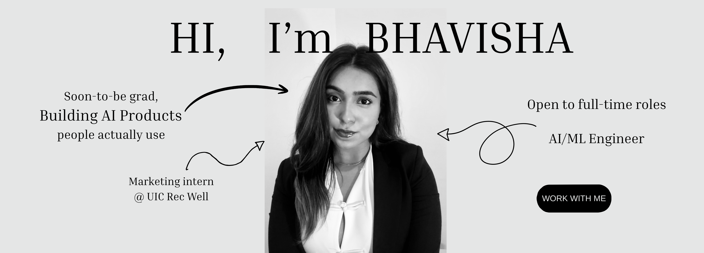

# Hi, I'm Bhavisha 👋
 
AI/ML Engineer | Data Science (CS) @ UIC '26 | Building AI-powered products
 
I build products that sit at the intersection of AI, data, and user experience. Most recently I shipped **CreatorOS**, an AI content planning tool with a RAG pipeline, OAuth integration, and an automated eval suite. Currently looking for full-time roles (AI/ML Engineer or AI Product Management) starting August 2026.
 
---
 
## 🚀 Featured Project
 
### [CreatorOS](https://github.com/Bhavishaahuja/CreatorOS)
AI-powered content planning for Instagram creators. Connects to Google Calendar, identifies open shooting days, and generates a personalized content plan with shoot, edit, and post deadlines.
 
- Built a **RAG pipeline** using pgvector embeddings to improve suggestions based on approval history across sessions
- Implemented **prompt versioning** to track every Claude prompt change, plus a 6-check automated eval suite
- Built **Google Calendar OAuth** with silent token refresh, handling malformed AI responses and edge cases in production
- Validated through user research with 7 Instagram creators before building
- **Stack:** Next.js · TypeScript · Supabase · pgvector · Claude API · OpenAI Embeddings · Google Calendar API · Vercel
---
 
## 🧪 Other Projects
 
**[Cell Type Classification — scRNA-seq](https://github.com/Bhavishaahuja/cell-type-classification-scrnaseq)**
Random Forest classifier identifying 8 cell types from 20,000 single-cell RNA-seq samples across ~3,000 gene features. Tackled extreme class imbalance and high dimensionality, improving accuracy from 98.5% to 99.1%.
`Python` `scikit-learn`
 
**[Urban Economic Opportunity Analysis](https://github.com/Bhavishaahuja/Urban-Economic-Opportunity-Analysis)**
End-to-end pipeline analyzing socioeconomic disparities across 4,406 census tracts in Chicago, NYC, Dallas, and Oklahoma City. Pulled data via the U.S. Census ACS API and compared 4 ML models to forecast poverty rates.
`Python` `U.S. Census API`
 
**[Cereals Rating](https://github.com/Bhavishaahuja/Cereals-Rating)**
Multiple linear regression analysis predicting Consumer Reports cereal ratings from nutritional data (76 cereals, 7 predictors). Used backward elimination to identify sodium, fiber, and sugar as key drivers, reaching 92%+ explanatory power.
`Python` `statsmodels`
 
**[HelpingHands — CRM Implementation Planning](https://github.com/Bhavishaahuja/HelpingHands-CRM-Implementation-Planning)**
Enterprise PM case study simulating a CRM implementation for a 12-office nonprofit. Covers the full project lifecycle: requirements gathering, stakeholder analysis, risk register, WBS, and data migration planning for a $150K cloud migration.
`Project Management` `Stakeholder Management`
 
---
 
## 🛠️ Tech I Work With
 
`TypeScript` · `Python` · `Next.js` · `Supabase` · `pgvector` · `Claude API` · `REST APIs` · `OAuth` · `scikit-learn` · `statsmodels`
 
---
 
## 📫 Let's Connect
 
I'm always interested in talking with product managers, founders, and engineers working on the future of AI products.
 
[LinkedIn](https://www.linkedin.com/in/bhavisha-ahuja180503/) · bhavishaahuja800@gmail.com
