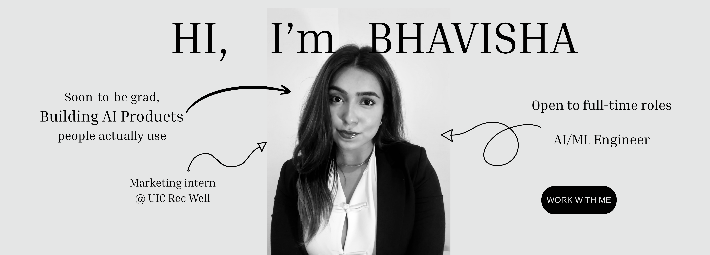

## Hi, I'm Bhavisha 👋
 
**AI/ML Engineer | Data Science (CS) @ UIC '26 | Building AI-powered products**
 
I build products that sit at the intersection of AI, data, and user experience. Recently I shipped **PrepPilot**, an AI agent that researches people and companies and writes meeting briefings, and **CreatorOS**, an AI content planning tool with a RAG pipeline, OAuth integration, and an automated eval suite. I'm looking for full-time roles in AI/ML Engineering or AI Product Management, available now.
 
### 🚀 Featured Projects
 
**[PrepPilot](https://github.com/Bhavishaahuja/preppilot)**
An AI briefing agent. You tell it who you're meeting, and it plans the research, searches the web from six angles, confirms it found the right person, and writes a structured briefing you can copy or export as a PDF.
 
* Built a custom agentic pipeline from scratch (plan → research → resolve identity → filter → brief) instead of using an agent framework, for full control over each step
* Used forced tool-use with the Claude API to get reliable structured JSON out of every step, plus validation and error handling around each tool call
* Parallelized the research step, cutting briefing time from ~90s to ~20s
* Shipped with real accounts: Supabase magic-link auth, per-user profiles and briefing history secured with row-level security, and custom email delivery through Resend
* Stack: Python · FastAPI · Claude API · Tavily · React · Vite · Tailwind CSS · Supabase · Render · Vercel
**[CreatorOS](https://github.com/Bhavishaahuja/CreatorOS)**
AI-powered content planning for Instagram creators. Connects to Google Calendar, identifies open shooting days, and generates a personalized content plan with shoot, edit, and post deadlines.
 
* Built a RAG pipeline using pgvector embeddings to improve suggestions based on approval history across sessions
* Implemented prompt versioning to track every Claude prompt change, plus a 26-check automated eval suite
* Built Google Calendar OAuth with silent token refresh, handling malformed AI responses and edge cases in production
* Validated through user research with 17 Instagram creators before building
* Stack: Next.js · TypeScript · Supabase · pgvector · Claude API · OpenAI Embeddings · Google Calendar API · Vercel

  
**[CartLens](https://github.com/Bhavishaahuja/CartLens)**
End-to-end e-commerce customer analytics on the Olist dataset (~100K orders across 9 relational tables), from raw CSVs to a cloud warehouse to Power BI and Tableau dashboards, framed as business findings.
 
* Built a Python ETL pipeline and loaded the data into a BigQuery warehouse, with product images stored separately in a Google Cloud Storage bucket
* Wrote 5 SQL analytics views: RFM segmentation, cohort retention, delivery time vs reviews, category affinity, and image quality vs sales
* Found that late deliveries drop average reviews from 4.29 to 2.27 stars, and that retention falls off a cliff after the first order
* Caught and corrected an average-of-ratios bias in cohort retention (the simple average overstated month-1 retention by ~10x)
* Extracted computer vision features (sharpness, brightness, dominant color) from product images and tested whether image quality relates to reviews and sales
* Stack: Python · SQL · BigQuery · Google Cloud Storage · Power BI · DAX · Tableau · Pillow · scikit-learn
### 🧪 Other Projects
 
**[Cell Type Classification: scRNA-seq](https://github.com/Bhavishaahuja/cell-type-classification-scrnaseq)**
Random Forest classifier identifying 8 cell types from 20,000 single-cell RNA-seq samples across ~3,000 gene features. Tackled extreme class imbalance and high dimensionality, improving accuracy from 98.5% to 99.1%. `Python` `scikit-learn`
 
**[Urban Economic Opportunity Analysis](https://github.com/Bhavishaahuja/Urban-Economic-Opportunity-Analysis)**
End-to-end pipeline analyzing socioeconomic disparities across 4,406 census tracts in Chicago, NYC, Dallas, and Oklahoma City. Pulled data via the U.S. Census ACS API and compared 4 ML models to forecast poverty rates. `Python` `U.S. Census API`
 
**[Cereals Rating](https://github.com/Bhavishaahuja/Cereals-Rating)**
Multiple linear regression analysis predicting Consumer Reports cereal ratings from nutritional data (76 cereals, 7 predictors). Used backward elimination to identify sodium, fiber, and sugar as key drivers, reaching 92%+ explanatory power. `Python` `statsmodels`
 
**[HelpingHands: CRM Implementation Planning](https://github.com/Bhavishaahuja/HelpingHands-CRM-Implementation-Planning)**
Enterprise PM case study simulating a CRM implementation for a 12-office nonprofit. Covers the full project lifecycle: requirements gathering, stakeholder analysis, risk register, WBS, and data migration planning for a $150K cloud migration. `Project Management` `Stakeholder Management`
 
### 🛠️ Tech I Work With
 
**AI & Backend:** `Python` · `FastAPI` · `Claude API` · `RAG` · `pgvector` · `REST APIs` · `OAuth`
**Frontend:** `TypeScript` · `React` · `Next.js` · `Tailwind CSS`
**Data & Analytics:** `SQL` · `BigQuery` · `Google Cloud Storage` · `Power BI` · `Tableau` · `scikit-learn` · `statsmodels`
**Infra:** `Supabase` · `Vercel` · `Render` · `AWS Certified Cloud Practitioner`
 
### 📫 Let's Connect
 
I'm always interested in talking with product managers, founders, and engineers working on the future of AI products.
 
[LinkedIn](https://www.linkedin.com/in/bhavisha-ahuja180503/) · [bhavishaahuja800@gmail.com](mailto:bhavishaahuja800@gmail.com)
 
