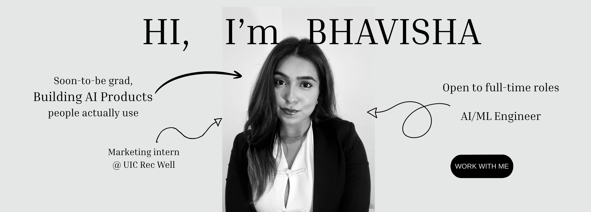

# Hi, I'm Bhavisha (https://www.bhavishaahuja.pro/) 👋
 
**AI/ML Engineer · Data Science (CS) @ UIC '26 · Building AI-powered products**
 
I build products where AI, data, and user experience meet. My latest work includes **PrepPilot**, an AI agent that researches people and companies and writes meeting briefings, **CreatorOS**, a content planning tool with a RAG pipeline and an automated eval suite, and **DeCode**, a multi-agent system I built in a 26-hour hackathon.
 
I'm looking for full-time roles in **AI/ML Engineering** or **AI Product Management**, and I'm available now.
 
🌐 [bhavishaahuja.pro](https://www.bhavishaahuja.pro/) · 💼 [LinkedIn](https://www.linkedin.com/in/bhavisha-ahuja180503/) · ✉️ [Email](mailto:bhavishaahuja800@gmail.com)
 
---
 
## 🔨 Currently building
 
**Cartkeeper**, an AI shopping agent with a spending conscience. Agentic checkout stalled on trust, so I'm building the missing layer: every purchase gets checked against your budget, blocked categories, and auto-approve limit. Anything over the limit pauses for your approval, anything out of bounds gets refused, and every decision lands in an audit log.
`LangGraph` `Claude API` `Stripe Agent Toolkit` `FastAPI` `Supabase` `React`
 
---
 
## 🚀 Featured Projects
 
### [PrepPilot](https://github.com/Bhavishaahuja/preppilot) · [Live demo](https://preppilot-alpha.vercel.app)
An AI briefing agent. Tell it who you're meeting, and it plans the research, searches the web from six angles, confirms it found the right person, and writes a structured briefing you can copy or export as a PDF.
 
- Built a custom agentic pipeline from scratch (plan → research → resolve identity → filter → brief) instead of using an agent framework, so I had full control over each step
- Used forced tool-use with the Claude API to get reliable structured JSON out of every step, with validation and error handling around each tool call
- Parallelized the research step, cutting briefing time from ~90s to ~20s
- Shipped with real accounts: Supabase magic-link auth, per-user profiles and briefing history secured with row-level security, and custom email delivery through Resend
- Containerized the FastAPI backend with Docker and added a Kubernetes self-hosting path (production runs on Render + Vercel)
**Stack:** Python · FastAPI · Claude API · Tavily · React · Vite · TypeScript · Tailwind CSS · Supabase (PostgreSQL) · Docker · Kubernetes · Render · Vercel
 
### [CreatorOS](https://github.com/Bhavishaahuja/CreatorOS) · [Live demo](https://creator-os-seven-topaz.vercel.app)
AI-powered content planning for Instagram creators. It connects to Google Calendar, finds your open shooting days, and generates a personalized content plan with shoot, edit, and post deadlines.
 
- Validated the idea through user research with 17 Instagram creators before writing any code
- Built a RAG pipeline with pgvector embeddings so suggestions improve based on approval history across sessions
- Added prompt versioning to track every Claude prompt change, plus a 26-check automated eval suite
- Built Google Calendar OAuth with silent token refresh, and handled malformed AI responses and edge cases in production
**Stack:** Next.js · TypeScript · Supabase · pgvector · Claude API · OpenAI Embeddings · Google Calendar API · Vercel
 
### [DeCode](https://github.com/Bhavishaahuja/DeCode) · AEC Tech Hackathon 2026
A multi-agent AI system that reverse-engineers ancient megaprojects (the pyramids at Giza, Uruk, Mohenjo-daro, the Qin walls) using contractor methodology and turns them into a modern build playbook. Built in 26 hours at Gensler Chicago, where I did about 80% of the build on a 5-person team.
 
- Designed a 7-stage agent pipeline (router → archaeologist → engineer → estimator → builder → critic → presenter), with a critic step that checks every answer before it reaches the user
- Grounded every conclusion in cited archaeological sources through an evidence layer that ingests, indexes, and verifies construction claims
- Kept the math out of the LLM: labor and time estimates, haul force, and carbon come from deterministic engineering tools exposed through a FastAPI service
- Added a rule-based fallback so the full pipeline still runs with no API key
**Stack:** Python · FastAPI · Uvicorn · Claude API
 
### [CartLens](https://github.com/Bhavishaahuja/CartLens)
End-to-end e-commerce customer analytics on the Olist dataset (~100K orders across 9 relational tables), from raw CSVs to a cloud warehouse to Power BI and Tableau dashboards, framed as business findings.
 
- Built a Python ETL pipeline into a BigQuery warehouse, with product images stored separately in Google Cloud Storage
- Wrote 5 SQL analytics views: RFM segmentation, cohort retention, delivery time vs reviews, category affinity, and image quality vs sales
- Found that late deliveries drop average reviews from 4.29 to 2.27 stars, and that retention falls off a cliff after the first order
- Caught and fixed an average-of-ratios bias in cohort retention (the simple average overstated month-1 retention by ~10x)
- Extracted computer vision features (sharpness, brightness, dominant color) from product images to test whether image quality relates to reviews and sales
**Stack:** Python · SQL · BigQuery · Google Cloud Storage · Power BI · DAX · Tableau · Pillow · scikit-learn
 
---
 
## 🧪 Other Projects
 
- **[Cell Type Classification (scRNA-seq)](https://github.com/Bhavishaahuja/cell-type-classification-scrnaseq):** Random Forest classifier that identifies 8 cell types from 20,000 single-cell RNA-seq samples across ~3,000 gene features. Handled extreme class imbalance and high dimensionality, improving accuracy from 98.5% to 99.1%. `Python` `scikit-learn`
- **[Urban Economic Opportunity Analysis](https://github.com/Bhavishaahuja/Urban-Economic-Opportunity-Analysis):** End-to-end pipeline analyzing socioeconomic disparities across 4,406 census tracts in Chicago, NYC, Dallas, and Oklahoma City. Pulled data from the U.S. Census ACS API and compared 4 ML models to forecast poverty rates. `Python` `U.S. Census API`
- **[Cereals Rating](https://github.com/Bhavishaahuja/Cereals-Rating):** Multiple linear regression predicting Consumer Reports cereal ratings from nutritional data (76 cereals, 7 predictors). Used backward elimination to identify sodium, fiber, and sugar as the key drivers, explaining 92%+ of the variance in ratings. `Regression` `Statistics`
---
 
## 🛠️ Tech I work with
 
**Languages:** Python · TypeScript · SQL · R
**AI/ML:** Claude API · LangGraph · RAG · pgvector · OpenAI Embeddings · scikit-learn · prompt evals
**Backend & Data:** FastAPI · Supabase / PostgreSQL · BigQuery · Google Cloud Storage
**Frontend:** React · Next.js · Vite · Tailwind CSS
**Infra:** Docker · Kubernetes · Render · Vercel · AWS
**BI:** Power BI · Tableau
 
🏅 AWS Certified Cloud Practitioner
 
---
 
📫 Open to AI/ML Engineering and AI Product roles. Easiest way to reach me is [LinkedIn](https://www.linkedin.com/in/bhavisha-ahuja180503/) or [email](mailto:bhavishaahuja800@gmail.com).
